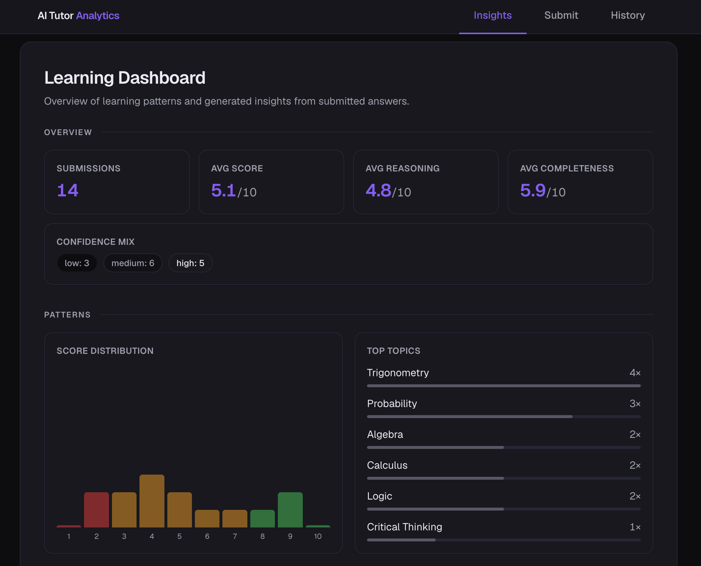
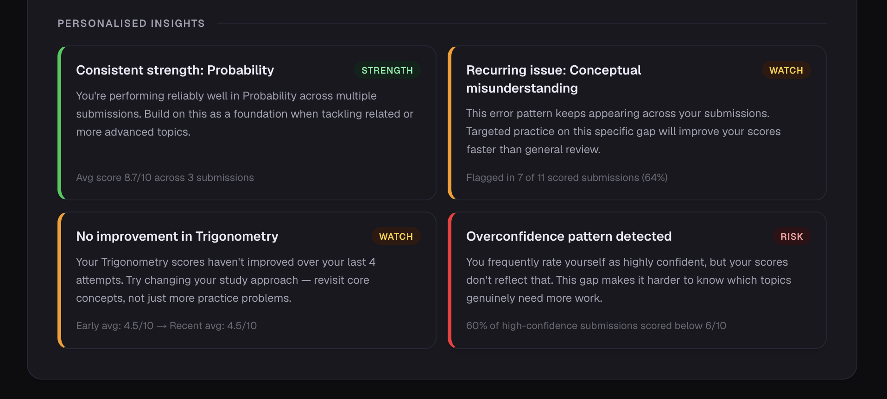

# AI Tutor Analytics

An AI-powered learning analytics platform that evaluates student answers, identifies recurring mistake patterns, and surfaces actionable insights — without needing a human tutor to interpret the data.

---

Most feedback tools tell students *what* they got wrong. This one tells them *why they keep getting it wrong*. Each submitted answer is evaluated by an AI tutor and tagged with structured diagnostic labels — error types, strengths, missing concepts, and confidence level. A deterministic insight engine then runs rule-based detectors across submission history to surface named learning signals: overconfidence gaps, recurring weaknesses, topic stagnation, and consistent strengths.

The insight engine uses no AI at runtime — it's fully rule-based, auditable, and produces consistent results. This means zero hallucination risk on the analytics layer, and insights that can be explained and verified without treating the model as a black box.

---

## Screenshots

*Learning signal overview*


*Personalised diagnostic insights*


---

## How it works

- **Q&A submission** — student submits a question and answer, self-reporting their confidence level before receiving feedback
- **Structured AI tagging** — OpenAI evaluates the answer and returns a fixed-schema JSON object: scores (overall, reasoning, completeness), error types from a closed taxonomy, strengths, misconceptions, missing concepts, and a suggested next step
- **Sanitisation layer** — all AI output is validated at the API boundary against a closed label set; out-of-range values are rejected before hitting the database
- **Deterministic analytics engine** — rule-based detectors run across submission history with no additional AI calls, producing consistent and auditable insights
- **Live dashboard** — insights, score distribution, topic breakdown, and confidence trends update automatically after each submission via a custom browser event

---

## Key features

- **Insights dashboard** — classifies learning signals as Risk, Watch, or Strength with clear diagnostic copy
- **Overconfidence detection** — flags when a student's self-reported confidence consistently exceeds their actual performance
- **Persistent weakness detection** — identifies the dominant error pattern across all submissions (e.g. repeated conceptual misunderstanding)
- **Topic stagnation detection** — detects when a student's scores on a specific topic have stopped improving over multiple attempts
- **Strength recognition** — surfaces topics where the student is performing reliably well, to reinforce confidence
- **Structured feedback system** — each submission returns a scored, tagged diagnostic with a concrete next step, not just a grade

---

## Stack

| Layer | Technology |
|-------|-----------|
| Framework | Next.js 16 (App Router) |
| AI evaluation | OpenAI `gpt-4o-mini` with structured JSON output |
| Database | Supabase (Postgres) |
| Language | TypeScript |
| Styling | Tailwind CSS v4, dark-first design system |

---

## Running locally

```bash
npm install
cp .env.example .env.local  # add OPENAI_API_KEY, SUPABASE_URL, SUPABASE_SERVICE_ROLE_KEY
node scripts/seed.js        # populate demo data (14 rows, all 4 detectors active)
npm run dev
```

Navigate to `http://localhost:3000` — opens directly on the Insights dashboard.

---

## Project structure

```
app/
  insights/     ← analytics dashboard (default landing page)
  submit/       ← Q&A submission form with inline AI feedback
  history/      ← past submissions with expandable diagnostics
  api/feedback/ ← evaluation endpoint (OpenAI + Supabase write)
components/
  LearningAnalytics.tsx  ← insights dashboard and stat cards
  SubmissionsList.tsx    ← collapsible submission history
  Hero.tsx               ← submit form with live feedback panel
  FeedbackPanel.tsx      ← inline AI evaluation result
lib/
  analytics.ts   ← deterministic insight engine (pure functions)
  diagnostics.ts ← error type taxonomy and sanitisation
  format.ts      ← math formatting and colour utilities
scripts/
  seed.js        ← demo dataset (14 curated rows, all 4 detectors active)
```
